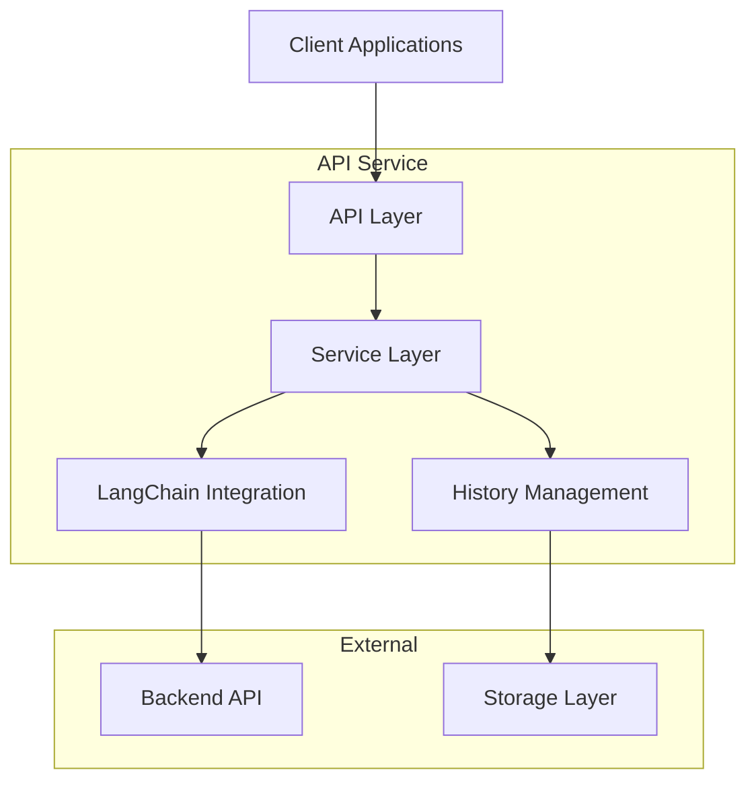
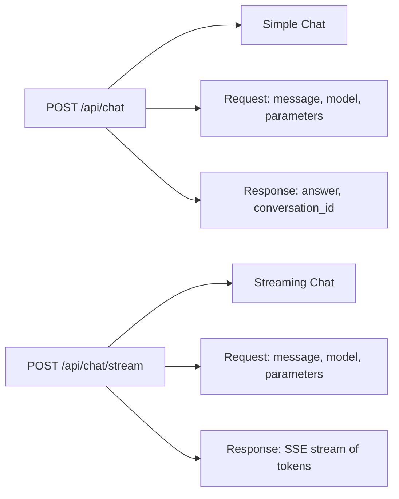
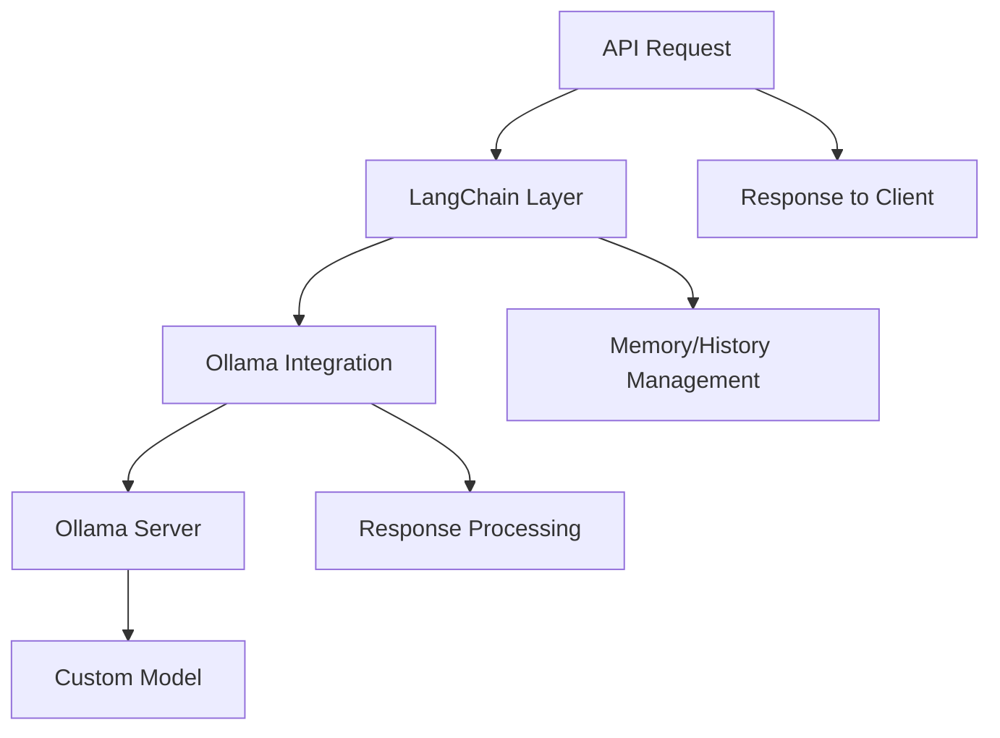
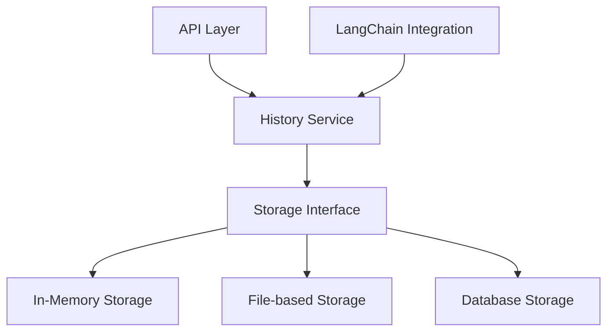
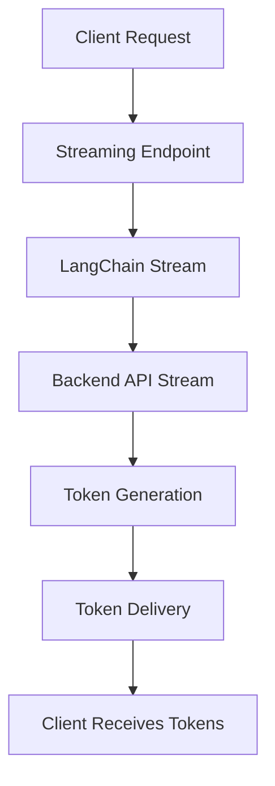
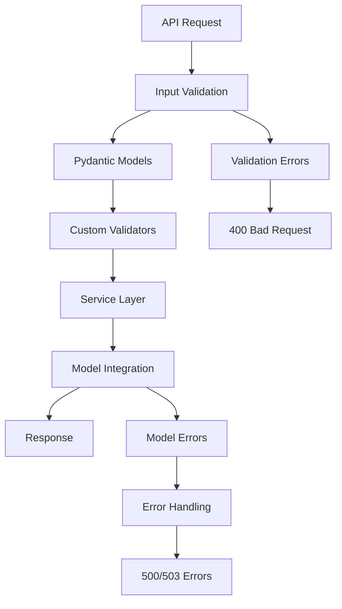
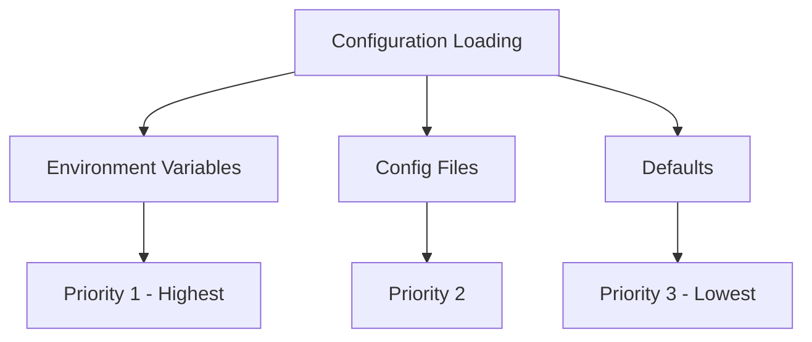
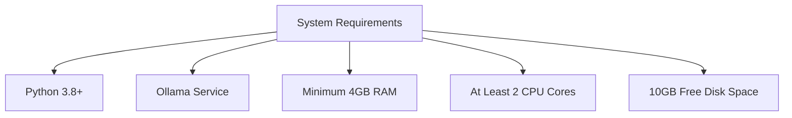

# Backend API Chat Service Design

## System Architecture



## Project Structure

```
backend-api-chat-service/
├── app.py                 # Main application entry point
├── requirements.txt       # Python dependencies
├── config.py             # Configuration management
├── README.md             # Project documentation
├── .env                  # Environment variables (not committed to version control)
├── .gitignore            # Git ignore file
├── api/
│   ├── __init__.py       # Package initializer
│   ├── routes.py         # API route definitions
│   └── middleware.py     # API middleware functions
├── models/
│   ├── __init__.py       # Package initializer
│   ├── ollama_client.py  # Ollama model interaction
│   └── chat_models.py    # LangChain model wrappers
├── services/
│   ├── __init__.py       # Package initializer
│   ├── chat_service.py   # Chat logic implementation
│   └── history_service.py# Conversation history management
├── utils/
│   ├── __init__.py       # Package initializer
│   ├── validators.py     # Input validation functions
│   └── helpers.py        # Utility functions
└── tests/                # Test files
    ├── __init__.py       # Package initializer
    ├── test_api.py       # API endpoint tests
    └── test_services.py  # Service layer tests
```

## API Endpoints Design

### 1. Chat Endpoints



**POST /api/chat**
- **Purpose**: Simple chat endpoint that returns the complete response
- **Request Body**:
  ```json
  {
    "message": "Hello, how are you?",
    "model": "custom-model-name", // Optional, uses default if not provided
    "conversation_id": "uuid", // Optional, creates new if not provided
    "parameters": { // Optional model parameters
      "temperature": 0.7,
      "max_tokens": 1000
    }
  }
  ```
- **Response**:
  ```json
  {
    "conversation_id": "uuid",
    "response": "I'm doing well, thank you for asking!",
    "timestamp": "2025-09-06T03:30:00Z"
  }
  ```

**POST /api/chat/stream**
- **Purpose**: Streaming chat endpoint that returns tokens in real-time
- **Request Body**: Same as /api/chat
- **Response**: Server-Sent Events (SSE) stream of tokens

### 2. History Management Endpoints

```mermaid
graph LR
    A[GET /api/history] --> B[List Conversations]
    C[GET /api/history/{id}] --> D[Get Conversation]
    E[DELETE /api/history/{id}] --> F[Delete Conversation]
    G[PUT /api/history/{id}] --> H[Update Conversation Title]
```

**GET /api/history**
- **Purpose**: List all conversation histories
- **Query Parameters**: 
  - `limit` (optional): Number of conversations to return (default: 10)
  - `offset` (optional): Offset for pagination (default: 0)
- **Response**:
  ```json
  {
    "conversations": [
      {
        "id": "uuid",
        "title": "Conversation about AI",
        "created_at": "2025-09-06T03:30:00Z",
        "updated_at": "2025-09-06T03:35:00Z",
        "message_count": 5
      }
    ],
    "total": 1,
    "limit": 10,
    "offset": 0
  }
  ```

**GET /api/history/{conversation_id}**
- **Purpose**: Retrieve a specific conversation
- **Response**:
  ```json
  {
    "id": "uuid",
    "title": "Conversation about AI",
    "created_at": "2025-09-06T03:30:00Z",
    "updated_at": "2025-09-06T03:35:00Z",
    "messages": [
      {
        "role": "user",
        "content": "Hello, how are you?",
        "timestamp": "2025-09-06T03:30:00Z"
      },
      {
        "role": "assistant",
        "content": "I'm doing well, thank you for asking!",
        "timestamp": "2025-09-06T03:30:05Z"
      }
    ]
  }
  ```

**DELETE /api/history/{conversation_id}**
- **Purpose**: Delete a conversation
- **Response**: 
 ```json
  {
    "message": "Conversation deleted successfully"
  }
  ```

**PUT /api/history/{conversation_id}**
- **Purpose**: Update conversation metadata (e.g., title)
- **Request Body**:
 ```json
  {
    "title": "New conversation title"
  }
  ```
- **Response**: Updated conversation object

### 3. Health Check Endpoint

**GET /api/health**
- **Purpose**: Check if the API service is running
- **Response**:
  ```json
  {
    "status": "healthy",
    "timestamp": "2025-09-06T03:30:00Z"
  }
  ```

### 4. Model Information Endpoint

**GET /api/models**
- **Purpose**: List available Ollama models
- **Response**:
  ```json
  {
    "models": [
      {
        "name": "llama2",
        "modified_at": "2025-09-01T10:00:00Z",
        "size": "3.8GB"
      },
      {
        "name": "custom-model-name",
        "modified_at": "2025-09-05T15:30:00Z",
        "size": "4.2GB"
      }
    ]
  }
  ```

## LangChain Integration with Backend API

### Integration Approach



### Key Components

1. **LangChain Backend API Integration**
   - Use custom API client for simple completions
   - Use custom chat API client for chat-based interactions
   - Both clients provide integration with backend REST API

2. **Model Configuration**
   - Model name (provided by user later)
   - Temperature (0.0-1.0)
   - Max tokens
   - Stop sequences
   - Other backend-specific parameters

3. **Connection Handling**
   - Base URL for Backend API (configured via environment variables)
   - Error handling for connection issues
   - Timeout management
   - Retry mechanisms

### LangChain Components to Use

1. **Chat Models**: Custom chat models for chat-based interactions
2. **Memory**: `ConversationBufferMemory` or `MongoDBChatMessageHistory` for history management
3. **Prompts**: `ChatPromptTemplate` for structuring interactions
4. **Chains**: Custom chains for processing user input and model responses

## Conversation History Management System

### Design Approach



### Data Structure

1. **Conversation Object**
   ```python
   {
     "id": "uuid",                    # Unique conversation identifier
     "title": "Conversation Title",   # Generated or user-defined title
     "created_at": "ISO timestamp",   # Creation timestamp
     "updated_at": "ISO timestamp",   # Last update timestamp
     "messages": [                    # List of message objects
       {
         "role": "user|assistant|system",
         "content": "Message content",
         "timestamp": "ISO timestamp"
       }
     ]
   }
   ```

2. **Message Object**
   ```python
   {
     "role": "user|assistant|system",  # Message sender role
     "content": "Message content",     # Actual message content
     "timestamp": "ISO timestamp"      # Message timestamp
   }
   ```

### Storage Options

1. **In-Memory Storage (Development)**
   - Simple dictionary-based storage
   - Fast access but not persistent
   - Suitable for development and testing

2. **File-based Storage (Simple Deployment)**
   - JSON file storage with one file per conversation
   - JSON file for conversation index
   - Basic persistence without database dependency

3. **Database Storage (Production)**
   - SQLite for simple local deployment
   - PostgreSQL/MongoDB for scalable deployments
   - Better performance and querying capabilities

## Streaming Responses Implementation

### Technology Approach



### Server-Sent Events (SSE) Implementation

1. **SE Format**
   - Content-Type: `text/event-stream`
   - Chunked transfer encoding
   - Data formatted as `data: {json}\n\n`
   - Optional event types: `event: message\n`
   - Keep-alive with comments: `:keep-alive\n\n`

2. **HTTP Headers for Streaming**
   ```http
   Content-Type: text/event-stream
   Cache-Control: no-cache
   Connection: keep-alive
   Access-Control-Allow-Origin: *
   ```

### LangChain Streaming Integration

1. **Using Backend API Streaming**
   ```python
   from myproject.chat_models import ChatBackendAPI
   
   chat_model = ChatBackendAPI(model="custom-model")
   
   # Streaming response
   for chunk in chat_model.stream("Hello, how are you?"):
       # Each chunk is a ChatGeneration object
       yield chunk.content
   ```

2. **Async Streaming Implementation**
   ```python
   async def stream_response(question):
       async for chunk in chat_model.astream(question):
           yield chunk.content
   ```

## API Documentation

### Overview
This API provides a RESTful interface for interacting with language models through a backend API and LangChain integration. It supports chat conversations, conversation history management, and real-time streaming responses.

### Base URL
```
http://localhost:8000/api
```

### Common Headers
```
Content-Type: application/json
Accept: application/json
```

### Error Responses
All endpoints can return these common error responses:

| Status Code | Description | Example Response |
|-------------|------------------|
| 400 | Bad Request - Invalid input | `{"error": "Invalid request format", "code": "INVALID_INPUT"}` |
| 404 | Not Found - Resource not found | `{"error": "Conversation not found", "code": "NOT_FOUND"}` |
| 500 | Internal Server Error | `{"error": "Internal server error", "code": "INTERNAL_ERROR"}` |
| 503 | Service Unavailable - Ollama not accessible | `{"error": "Ollama service unavailable", "code": "SERVICE_UNAVAILABLE"}` |

### 1. Chat Endpoints

#### POST /chat
Initiate a chat conversation with the model.

**Request Body:**
```json
{
  "message": "string, required - The user's message",
  "model": "string, optional - Model name (uses default if not provided)",
  "conversation_id": "string, optional - Existing conversation ID (creates new if not provided)",
  "parameters": {
    "temperature": "number, optional - Sampling temperature (0.0-1.0, default: 0.7)",
    "max_tokens": "integer, optional - Maximum tokens to generate (default: 1000)",
    "top_p": "number, optional - Nucleus sampling parameter (0.0-1.0)",
    "stop": "array of strings, optional - Stop sequences"
  }
}
```

**Example Request:**
```json
{
  "message": "Explain quantum computing in simple terms",
  "model": "llama2",
  "parameters": {
    "temperature": 0.7,
    "max_tokens": 500
  }
}
```

**Response:**
```json
{
  "conversation_id": "a1b2c3d4-e5f6-7890-g1h2-i3j4k5l6m7n8",
  "response": "Quantum computing is a type of computing that uses quantum bits or 'qubits' instead of traditional bits...",
  "timestamp": "2025-09-06T03:30:00Z"
}
```

#### POST /chat/stream
Initiate a streaming chat conversation with real-time token delivery.

**Request Body:** Same as POST /chat

**Response:** Server-Sent Events stream
```
data: {"token": "Quantum"}
data: {"token": " computing"}
data: {"token": " is"}
data: {"token": " a"}
data: {"token": " type"}
...
data: {"done": true}
```

**JavaScript Client Example:**
```javascript
const response = await fetch('/api/chat/stream', {
  method: 'POST',
  headers: {'Content-Type': 'application/json'},
  body: JSON.stringify({
    message: "Explain quantum computing",
    model: "llama2"
  })
});

const reader = response.body.getReader();
const decoder = new TextDecoder();

while (true) {
  const {done, value} = await reader.read();
  if (done) break;
  
  const chunk = decoder.decode(value);
  // Process SSE events
  const events = chunk.split('\n\n');
  for (const event of events) {
    if (event.startsWith('data: ')) {
      const data = JSON.parse(event.slice(6));
      if (data.token) {
        // Append token to UI
        console.log(data.token);
      }
    }
  }
}
```

### 2. History Management Endpoints

#### GET /history
List all conversation histories with pagination.

**Query Parameters:**
- `limit` (integer, optional): Number of conversations to return (default: 10, max: 100)
- `offset` (integer, optional): Offset for pagination (default: 0)

**Response:**
```json
{
  "conversations": [
    {
      "id": "a1b2c3d4-e5f6-7890-g1h2-i3j4k5l6m7n8",
      "title": "Quantum Computing Discussion",
      "created_at": "2025-09-06T03:30:00Z",
      "updated_at": "2025-09-06T03:35:00Z",
      "message_count": 5
    }
  ],
  "total": 1,
  "limit": 10,
  "offset": 0
}
```

#### GET /history/{conversation_id}
Retrieve a specific conversation.

**Response:**
```json
{
  "id": "a1b2c3d4-e5f6-7890-g1h2-i3j4k5l6m7n8",
  "title": "Quantum Computing Discussion",
  "created_at": "2025-09-06T03:30:00Z",
  "updated_at": "2025-09-06T03:35:00Z",
  "messages": [
    {
      "role": "user",
      "content": "Explain quantum computing in simple terms",
      "timestamp": "2025-09-06T03:30:00Z"
    },
    {
      "role": "assistant",
      "content": "Quantum computing is a type of computing that uses quantum bits or 'qubits'...",
      "timestamp": "2025-09-06T03:30:05Z"
    }
  ]
}
```

#### PUT /history/{conversation_id}
Update conversation metadata.

**Request Body:**
```json
{
  "title": "New conversation title"
}
```

**Response:** Updated conversation object (same as GET /history/{conversation_id})

#### DELETE /history/{conversation_id}
Delete a conversation.

**Response:**
```json
{
  "message": "Conversation deleted successfully"
}
```

### 3. Health and Model Endpoints

#### GET /health
Check if the API service is running.

**Response:**
```json
{
  "status": "healthy",
  "timestamp": "2025-09-06T03:30:00Z"
}
```

#### GET /models
List available Ollama models.

**Response:**
```json
{
  "models": [
    {
      "name": "llama2",
      "modified_at": "2025-09-01T10:00:00Z",
      "size": "3.8GB"
    },
    {
      "name": "custom-model-name",
      "modified_at": "2025-09-05T15:30:00Z",
      "size": "4.2GB"
    }
  ]
}
```

## Error Handling and Input Validation

### Input Validation Strategy



### Input Validation

1. **Pydantic Models for Request Validation**
   ```python
   from pydantic import BaseModel, Field, validator
   from typing import Optional, Dict, Any
   
   class ModelParameters(BaseModel):
       temperature: Optional[float] = Field(0.7, ge=0.0, le=1.0)
       max_tokens: Optional[int] = Field(1000, ge=1, le=4096)
       top_p: Optional[float] = Field(None, ge=0.0, le=1.0)
       stop: Optional[list[str]] = None
       
       @validator('temperature')
       def validate_temperature(cls, v):
           if v is not None and (v < 0.0 or v > 1.0):
               raise ValueError('Temperature must be between 0.0 and 1.0')
           return v
   
   class ChatRequest(BaseModel):
       message: str = Field(..., min_length=1, max_length=10000)
       model: Optional[str] = Field(None, max_length=100)
       conversation_id: Optional[str] = Field(None, max_length=100)
       parameters: Optional[ModelParameters] = None
   ```

### Error Categories and Handling

1. **Client Errors (4xx)**
   ```python
   class APIError(Exception):
       def __init__(self, message: str, code: str, status_code: int = 400):
           self.message = message
           self.code = code
           self.status_code = status_code
   ```

   | Error Type | Status Code | Error Code | Description |
   |------------|-------------|------------|-------------|
   | InvalidInput | 400 | INVALID_INPUT | Request validation failed |
   | NotFound | 404 | NOT_FOUND | Resource not found |
   | Conflict | 409 | CONFLICT | Resource conflict |
   | RateLimit | 429 | RATE_LIMIT | Too many requests |

2. **Server Errors (5xx)**
   | Error Type | Status Code | Error Code | Description |
   |------------|-------------|------------|-------------|
   | InternalError | 500 | INTERNAL_ERROR | Unexpected server error |
   | ServiceUnavailable | 503 | SERVICE_UNAVAILABLE | Ollama service not accessible |
   | Timeout | 504 | TIMEOUT | Request timeout |

## Configuration Management

### Configuration Sources Hierarchy



### Configuration Parameters

1. **API Configuration**
   - `API_HOST`: Host address (default: "0.0.0.0")
   - `API_PORT`: Port number (default: 8000)
   - `API_DEBUG`: Debug mode (default: False)
   - `API_WORKERS`: Number of worker processes (default: 1)

2. **Ollama Configuration**
   - `OLLAMA_BASE_URL`: Ollama service URL (default: "http://localhost:11434")
   - `OLLAMA_DEFAULT_MODEL`: Default model name (default: "llama2")
   - `OLLAMA_TIMEOUT`: Request timeout in seconds (default: 300)
   - `OLLAMA_RETRIES`: Number of retry attempts (default: 3)

3. **Model Parameters (Defaults)**
   - `MODEL_DEFAULT_TEMPERATURE`: Default temperature (default: 0.7)
   - `MODEL_DEFAULT_MAX_TOKENS`: Default max tokens (default: 1000)
   - `MODEL_DEFAULT_TOP_P`: Default top-p value (default: 1.0)

4. **History Management**
   - `HISTORY_STORAGE_TYPE`: Storage type (memory, file, database) (default: "memory")
   - `HISTORY_FILE_PATH`: File storage path (default: "./data/conversations")
   - `HISTORY_DB_URL`: Database connection URL (default: None)
   - `HISTORY_MAX_CONVERSATIONS`: Maximum conversations to keep (default: 1000)

5. **Rate Limiting**
   - `RATE_LIMIT_ENABLED`: Enable rate limiting (default: True)
   - `RATE_LIMIT_REQUESTS`: Requests per minute (default: 10)
   - `RATE_LIMIT_STREAMS`: Concurrent streams (default: 2)

6. **Logging Configuration**
   - `LOG_LEVEL`: Logging level (default: "INFO")
   - `LOG_FILE`: Log file path (default: None - console only)
   - `LOG_FORMAT`: Log format (default: "structured")

## Deployment and Setup Instructions

### System Requirements



#### Minimum Requirements
- **Operating System**: Windows 10+, macOS 10.15+, or Linux (Ubuntu 20.04+, CentOS 8+)
- **Python Version**: 3.8 or higher
- **RAM**: 4GB minimum (8GB recommended)
- **CPU**: 2 cores minimum (4 cores recommended)
- **Disk Space**: 10GB free space for models and application
- **Ollama**: Version 0.1.0 or higher

#### Ollama Installation

1. **Windows Installation**
   ```bash
   # Download Ollama for Windows from https://ollama.com/download/OllamaSetup.exe
   # Run the installer and follow the prompts
   # Verify installation
   ollama --version
   ```

2. **macOS Installation**
   ```bash
   # Using Homebrew
   brew install ollama
   
   # Or download from https://ollama.com/download/Ollama-darwin.zip
   # Verify installation
   ollama --version
   ```

3. **Linux Installation**
   ```bash
   # Install using curl
   curl -fsSL https://ollama.com/install.sh | sh
   
   # Or using package managers
   # Ubuntu/Debian:
   sudo apt update && sudo apt install ollama
   
   # Verify installation
   ollama --version
   ```

### Installation Steps

#### 1. Clone or Download the Repository
```bash
# Clone the repository (if using git)
git clone <repository-url>
cd ollama-langchain-api

# Or create project directory
mkdir ollama-langchain-api
cd ollama-langchain-api
```

#### 2. Create Virtual Environment
```bash
# Create virtual environment
python -m venv venv

# Activate virtual environment
# Windows:
venv\Scripts\activate

# macOS/Linux:
source venv/bin/activate
```

#### 3. Install Dependencies
```bash
# Install required packages
pip install -r requirements.txt

# Or install packages individually
pip install fastapi uvicorn langchain langchain-community httpx pydantic python-dotenv
```

#### 4. Pull Required Ollama Models
```bash
# Pull a model (replace with your preferred model)
ollama pull llama2

# List available models
ollama list

# Verify model is working
ollama run llama2 "Hello, how are you?"
```

### Configuration Setup

#### 1. Environment Variables
Create a `.env` file in the project root:

```env
# API Configuration
API_HOST=0.0.0
API_PORT=8000
API_DEBUG=False
API_WORKERS=1

# Ollama Configuration
OLLAMA_BASE_URL=http://localhost:11434
OLLAMA_DEFAULT_MODEL=llama2
OLLAMA_TIMEOUT=30
OLLAMA_RETRIES=3

# Model Parameters
MODEL_DEFAULT_TEMPERATURE=0.7
MODEL_DEFAULT_MAX_TOKENS=1000
MODEL_DEFAULT_TOP_P=1.0

# History Management
HISTORY_STORAGE_TYPE=file
HISTORY_FILE_PATH=./data/conversations
HISTORY_MAX_CONVERSATIONS=1000

# Rate Limiting
RATE_LIMIT_ENABLED=True
RATE_LIMIT_REQUESTS=10
RATE_LIMIT_STREAMS=2

# Logging
LOG_LEVEL=INFO
```

#### 2. Directory Setup
```bash
# Create data directory for file-based history storage
mkdir -p data/conversations

# Create logs directory (if using file logging)
mkdir -p logs
```

### Running the Service

#### Development Mode
```bash
# Run with auto-reload for development
uvicorn app:app --host 0.0.0 --port 8000 --reload

# Or using the built-in script (if available)
python app.py
```

#### Production Mode
```bash
# Run with multiple workers for production
uvicorn app:app --host 0.0.0 --port 8000 --workers 4

# Run in background
nohup uvicorn app:app --host 0.0.0 --port 8000 --workers 4 > app.log 2>&1 &
```

### Docker Deployment

#### 1. Dockerfile
```dockerfile
FROM python:3.9-slim

WORKDIR /app

COPY requirements.txt .
RUN pip install --no-cache-dir -r requirements.txt

COPY . .

EXPOSE 8000

CMD ["uvicorn", "app:app", "--host", "0.0", "--port", "8000", "--workers", "4"]
```

#### 2. Docker Compose
```yaml
version: '3.8'

services:
  ollama-api:
    build: .
    ports:
      - "800:8000"
    environment:
      - OLLAMA_BASE_URL=http://host.docker.internal:11434
    volumes:
      - ./data:/app/data
    depends_on:
      - ollama

  ollama:
    image: ollama/ollama:latest
    ports:
      - "11434:11434"
    volumes:
      - ollama-data:/root/.ollama

volumes:
  ollama-data:
```

#### 3. Running with Docker
```bash
# Build and run
docker-compose up --build

# Run in detached mode
docker-compose up -d

# View logs
docker-compose logs -f
```

## Features Implemented

- ✅ Simple chat endpoint (`POST /api/chat`)
- ✅ Streaming chat endpoint (`POST /api/chat/stream`)
- ✅ Conversation history management (`GET/PUT/DELETE /api/history`)
- ✅ Model information endpoints (`GET /api/models`)
- ✅ Health checks (`GET /api/health`)
- ✅ Comprehensive error handling and validation
- ✅ Flexible configuration management
- ✅ Multiple deployment options
- ✅ Detailed API documentation

## Technology Stack

- **Framework**: FastAPI for high-performance API
- **LangChain**: For model integration and conversation management
- **Ollama**: For local large language model serving
- **Pydantic**: For request validation and configuration management
- **Uvicorn**: ASGI server for production deployment

This architecture provides a solid foundation for a production-ready service that can be easily extended with additional features.